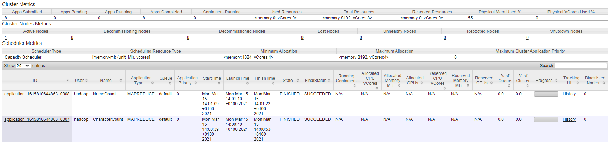
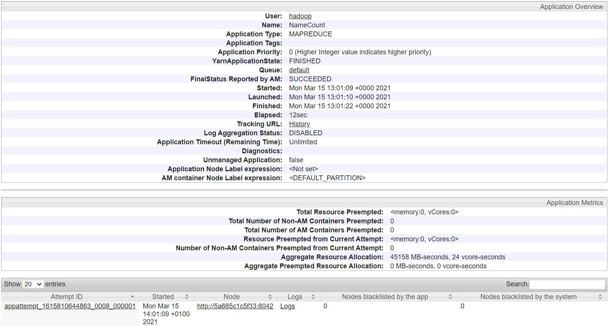

In this blog post we will be looking at how to use the Map-Reduce algorithm in Hadoop to mine data from [Project Gutenberg’s The Complete Works of William Shakespeare](https://raw.githubusercontent.com/rubigdata-dockerhub/hadoop-dockerfile/master/100.txt), by William Shakespeare.

## Hadoop Commands

Before we get into the content we should look at a few Hadoop commands which we will need to setup Hadoop.

| Command | Meaning |
| ------- | ------- |
| `start-dfs.sh` | Starts HDFS, including the nodes. |
| `start-yarn.sh` | Starts the resource manager Yarn. |
| `hdfs dfs -mkdir -p /user/hadoop` | Creates a new directory within the file system. By adding -p we ensure that the directory user is also created if it does not yet exist. |
| `hdfs dfs -put etc/hadoop/*.xml input` | All .xml files from the hadoop directory are copied to the input folder in the file system. |
| `yarn jar path grep input output 'dfs[a-z.]+'` | Using Yarn; runs Map-Reduce on input and writes everything that matches the Regex to output. |
| `hdfs dfs -get output output` | The output from the file system is copied to a local Docker folder. |
| `stop-yarn.sh` | Stops Yarn. |
| `stop-dfs.sh` | Stops the file system. |

We can now load the Shakespeare file into our file system. But first we should remove the .xml files we added in the tutorial, otherwise we will apply our Map-Reduce to those files too. While we're at it we should also remove the old output.

```bash
hdfs dfs -rm -R input
hdfs dfs -rm -R output
hdfs dfs -put 100.txt input
```

## Character Count

We can now make a Map-Reduce class to, for instance, count the total number of characters in the input file.
We first create a Text object to avoid having to repeatedly define it. In the mapper we then simply get the current line and write the length of this line to the context.

```java
public static class CharMapper extends Mapper<Object, Text, Text, IntWritable> {
    private Text CHARS = new Text("Characters");

    public void map(Object key, Text value, Context context)
            throws IOException, InterruptedException {
        String line = value.toString();
        int length = line.length();
        context.write(CHARS, new IntWritable(length));
    }
}
```

In the reducer we then simply get the total number of characters by summing the results of all mappers.

```java
public static class IntSumReducer extends Reducer<Text, IntWritable, Text, IntWritable> {
    private IntWritable result = new IntWritable();

    public void reduce(Text key, Iterable<IntWritable> values, Context context)
            throws IOException, InterruptedException {
        int sum = 0;
        for (IntWritable val : values) {
            sum += val.get();
        }

        result.set(sum);
        context.write(key, result);
    }
}
```

We can now compile and run this class.

```bash
hadoop com.sun.tools.javac.Main CharCount.java
jar cf cc.jar CharCount*.class
hadoop jar cc.jar CharCount input output
```

Which will then give us the following result:

```bash
Characters      5545144
```

## Romeo & Juliet

Using Map-Reduce we can also find the number of occurrences of Romeo and Juliet, to see who occurs more. We can keep track of both at the same time using two separate Text object, which allows us to find the results with only one pass over the corpus.

The mapper is defined below. Again we create object beforehand to avoid having to create them multiple times. We also use a Regex `\\W` to extract only alphabetical and numerical characters.
The reducer is the same as for the character count.

```java
public static class NameMapper
        extends Mapper<Object, Text, Text, IntWritable> {
    private final static IntWritable ONE = new IntWritable(1);
    private final Text Romeo = new Text("Romeo");
    private final Text Juliet = new Text("Juliet");

    public void map(Object key, Text value, Context context)
            throws IOException, InterruptedException {
        StringTokenizer itr = new StringTokenizer(value.toString());
        while (itr.hasMoreTokens()) {
            String name = itr.nextToken().replaceAll("\\W", "");
            if (name.equalsIgnoreCase("Romeo")){
                context.write(Romeo, ONE);
            } else if (name.equalsIgnoreCase("Juliet")){
                context.write(Juliet, ONE);
            }
        }
    }
}
```

Compiling and running this code gives us the following results, which tells us that Romeo appeared more often than Juliet.

```bash
Juliet      195
Romeo       291
```

## Web UI

We can get more information about Hadoop and how it ran our code by going to `localhost:8088` in our browser. Once we open this page we can see a bunch of information about our cluster.



We can get more information about an application by clicking on the ID, which opens a new page.



---

The source files of this assignment can be found on [GitHub](https://github.com/JordyAaldering/Big-Data/tree/master/assignment02).
